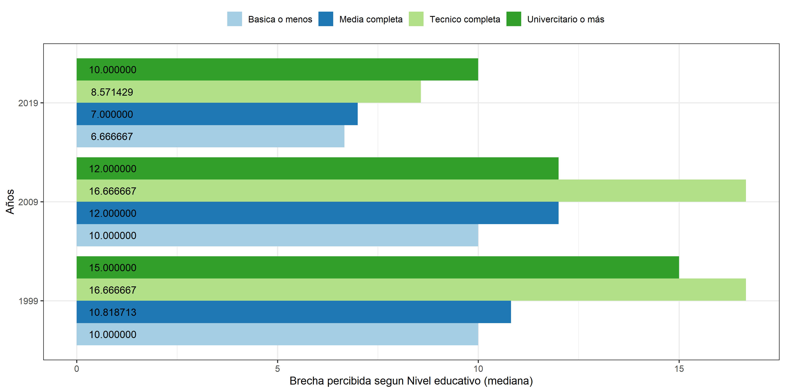
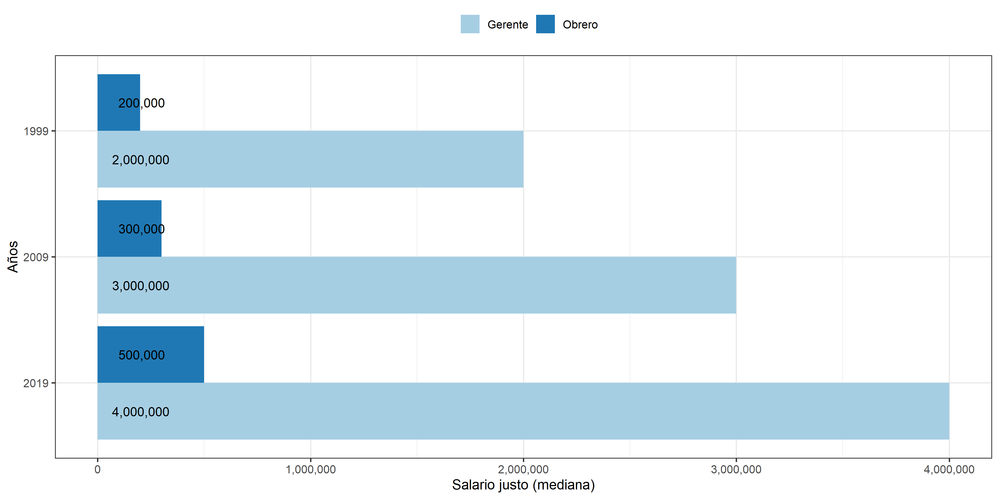
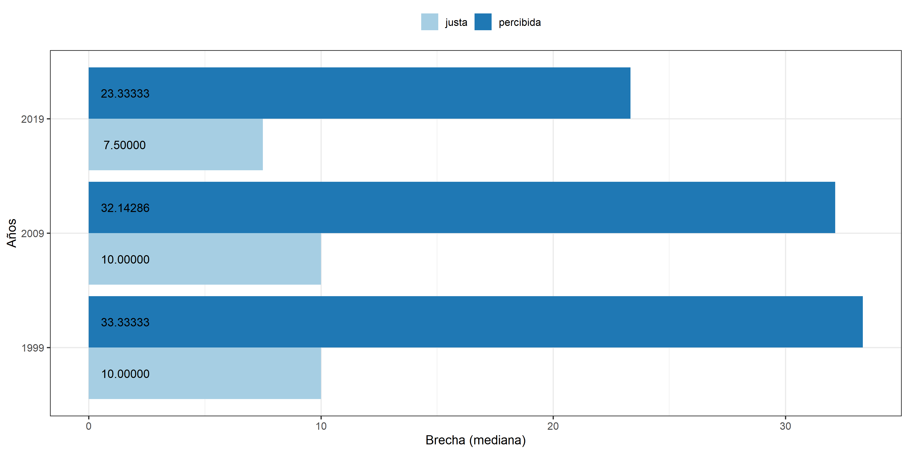
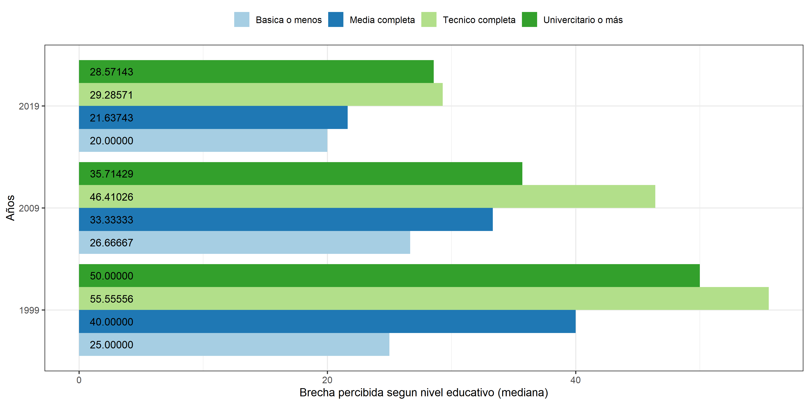
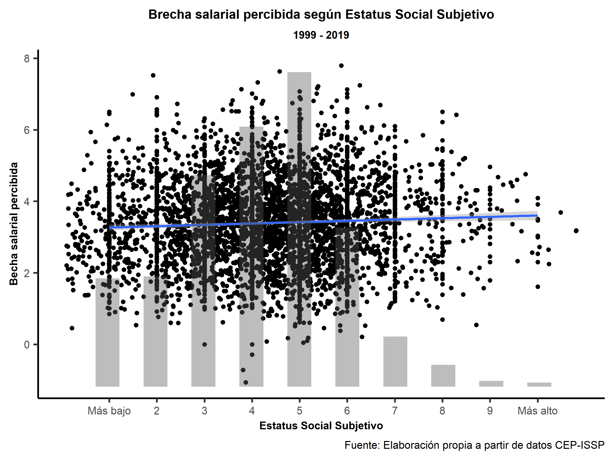
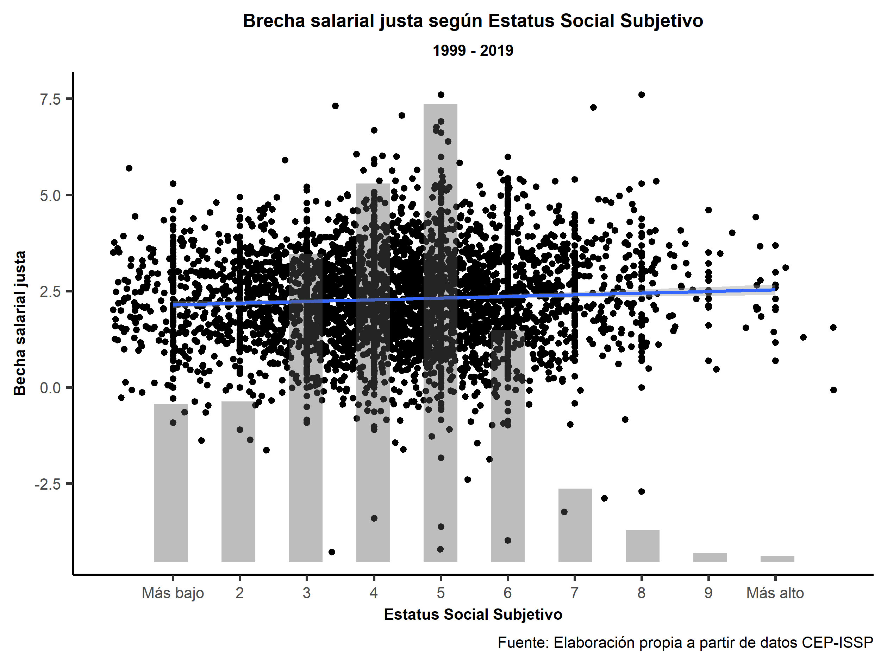

```{r include=FALSE}
knitr::opts_chunk$set(warning = FALSE,message = FALSE, cache = TRUE)
options(scipen=999)
rm(list=ls())
```

<div style="text-align: justify">

<h1> Cambios en la percepción y justificación de desigualdad salarial en Chile 1999-2009 </h1>

**Juan Carlos Castillo, Luis Maldonado, Julio Iturra & Francisco Meneses**


# Introducción

La desigualdad económica es un tema que se ha tomado la agenda nacional e internacional en el último tiempo. Las amenazas que representa la desigualdad para la democracia [@Bartels2008; @schlozman_unheavenly_2012], la creciente desigualdad entre países,  así como también la concentración de los ingresos en el 1% más rico (top incomes) representan un desafío a las ciencias sociales a la hora de dar cuenta de los orígenes y consecuencias de la desigualdad. Este desafío parece ser ahora más relevante que nunca en un contexto de estallido y crisis social en Chile desde el 18 de Octubre de 2019.

Las aproximaciones tradicionales de disciplinas como la economía han puesto el énfasis en la medición de la desigualdad objetiva vía ingresos, mientras la sociología se ha caracterizado por el estudio de clases ocupacionales y movilidad social. También desde la sociología han surgido perspectivas que enfatizan el rol de la subjetividad, relevando aspectos como la medida en que esta desigualdad es percibida y eventualmente rechazada (o justificada) por los individuos  [@Araujo2011; @castillo_inequality_2012; @mac-clure_Judgments_2015]. El foco en percepciones y justificaciones de situaciones de desigualdad emerge con fuerza en el debate nacional sobre crisis social, toda vez que los indicadores de crecimiento y desigualdad por si solos no permiten establecer una asociación clara con el escenario actual del país.

En el presente trabajo vamos a abordar de manera principalmente descriptiva algunos elementos de la investigación empírica sobre percepción y justificación de desigualdad, de modo que pueda servir como insumo al debate contingente. En esta línea, nos parece relevante asumir una perspectiva temporal de comparación, es decir, en qué medida la percepción y la justificación de la desigualdad han cambiado en Chile los últimos 20 años. Para ello, utilizaremos datos disponibles del módulo de desigualdad social de la encuesta ISSP (International Social Survey Programme - www.issp.org), aplicada en Chile en los años 1999, 2009 y 2019. Los datos de esta encuesta ofrecen una oportunidad única de analizar en el país en qué medida aumenta o disminuye la percepción de desigualdad, así como también su justificación. Este trabajo tiene sus antecedentes principales que analizan el período 1999-2009 [@castillo_inequality_2012], y que ahora se extiende una década más hasta 2019.

El documento se estructura de la siguiente manera: en primer lugar se entregarán ciertos antecedentes conceptuales y empíricos para el estudio de percepción y justificación de desigualdad, para luego mostrar resultados comparativos en el tiempo. En la segunda parte se le dará énfasis a las relaciones de estatus objetivo y subjetivo con la percepción de desigualdad y también a los cambios de estas relaciones en el tiempo.

# Percepción y justificación de desigualdad salarial

Los estudios de desigualdad y justicia social han sido nutridos por múltiples perspectivas. Desde la filosofía política se han dado amplios debates respecto a cuál es la manera normativamente correcta de distribuir los recursos, debate en el cual participan autores como Dworking  o Sen. Al respecto, @rawls_theory_1971 señala que los estudios sobre la justicia social deben considerar en su análisis las creencias concretas que poseen los sujetos, no para quedarse ciegamente con ellas, sino para generar un “equilibrio reflexivo”. Desde esta línea teórica del estudio de la desigualdad se desprende la importancia de conocer los criterios de justicia existentes en la población.

Desde la sociología se ha dado tradicionalmente un acento empírico al estudio de la desigualdad. Esta disciplina no solo tempranamente abordó el estudio de la distribución objetiva de los recursos en una población, sino que también pueden observarse reflexiones en torno al modo en cómo los sujetos perciben y se justifican la desigualdad existente. Por ejemplo, Max Weber realizó un gran aporte con su concepto de estatus subjetivo, con el que se refiere a la valoración que existe entre distintos grupos sociales. De manera más reciente, se han incorporado a este tipo de estudios el concepto de actitudes y percepciones hacia la desigualdad económica, relacionando dichos conceptos con la legitimación de la desigualdad  [@huber_Income_1973; @mason_Marketing_2000; @mau_Ungleichheitsund_1997; @stollte_Legitimation_1983].

El estudio de la desigualdad en términos subjetivos se puede abordar desde distintas perspectivas. Desde la investigación de encuestas de opinión pública, las preguntas directas por desigualdad (en particular por desigualdad percibida) presentan una serie de limitaciones toda vez que la mayor parte de la población actualmente tiende  declarar una alta desigualdad. La limitación consiste en que esta aproximación captura escasa variabilidad, y por lo tanto no entrega mayor información sobre diferencias entre personas ni en el tiempo  [@castillo_percepcion_2012]. Al respecto, una posible alternativa para analizar tanto percepción como justificación de desigualdad mediante encuestas consiste en una medida indirecta de desigualdad salarial. Para ello, se utilizan preguntas respecto de salarios percibidos y justos respecto de una serie de ocupaciones. En la encuesta ISSP existen 5 preguntas referidas a percepción de salarios. La pregunta es: ¿Cuánto cree Ud. que gana un …? Luego, se mencionan las siguientes ocupaciones:

- Obrero no calificado de una fábrica
- Vendedor de tienda
- Médico de medicina general
- Ministro del gobierno
- Gerente de una gran fábrica

Las respuestas son registradas como una magnitud en pesos. Luego se pregunta respecto a las mismas ocupaciones cuánto creen los entrevistados que se debería ganar en cada una de ellas. Para un análisis simplificado, utilizaremos las dos ocupaciones del extremo del continuo de estatus (obrero y gerente) para así analizar desigualdad salarial percibida y justificada entre ambas ocupaciones.

Cabe agregar que al trabajar con desigualdad de salarios es posible considerar dos perspectivas: la absoluta y la relativa. La primera refiere a si el salario de una ocupación o de un grupo puntual es considerado suficiente en sí mismo, y la segunda refiere a si en comparación a otros grupos dicha recompensa es justa. Para abordar la evaluación de justicia absoluta, revisaremos conjuntamente los salarios percibidos y justificados para obreros y gerentes. Luego, para evaluar la justicia relativa, observaremos las brechas salariales justas y percibidas, las cuales corresponden a la división del salario percibido del gerente por el salario percibido para un obrero. Esto nos indicara cuantas veces más creen las personas que gana un gerente en relación con un obrero, así como cuantas veces más consideran que esta proporción es justa.

## Desigualdad percibida y justa: salarios absolutos

A continuación nos abocaremos a exponer las percepciones y justificaciones respecto a las diferencias salariales entre obreros y gerentes. Para ello utilizaremos la mediana reportada por los entrevistados, la cual es un mejor indicador de tendencia central de montos en pesos al no estar afectado por posibles valores altos en los extremos.

**Grafico 1:  salario percibido de obrero y el gerente entre 1999 y 2019**



Lo primero que destaca de este grafico es la diferencia entre el salario percibido para el obrero y para el gerente. Ambos salarios muestran un aumento en estos 20 años, aunque en el gráfico el aumento del salario del obrero muestra un crecimiento menos notorio que el del gerente. No obstante el salario percibido del obrero creció más que el del gerente en términos proporcionales entre 1999 y 2009, puesto que mientras el primero aumenta más de tres veces, el segundo se incrementa en 2,7 veces.. Aun así, en términos concretos, el salario percibido del obrero solo aumento $210.000 entre estos años, mientras que el del gerente $5.000.000.

Resulta interesante que la mediana del salario el obrero se aproxima bastante al monto del salario mínimo del año respectivo. Esto nos lleva a deducir dos cosas: primero, las personas son conscientes del salario mínimo y, segundo, que asocian el salario de un obrero al salario mínimo. En cuanto al salario percibido para el gerente, éste posee una mayor varianza que el del obrero, lo que indica que hay un menor consenso en la población respecto a cuánto gana un gerente. Esto puede deberse a los distintos tipos de gerente que se están imaginando las personas al responder. Por ejemplo, según el estudio de la empresa internacional @roberthalf_Guia_2019 (encargada de reclutar de gerentes para el área de finanzas) en Chile el salario de un director de finanzas de una PYME o mediana empresa varía entre $5.000.000 y $9.500.000, mientras que el gerente de una gran empresa (sobre UF 100.000) gana entre $6.800.000 y $15.500.000 en promedio. Esto nos demuestra que existe gran diferencia entre un alto cargo de una empresa pequeña en relación con los altos cargos de una gran empresa.

En suma, tenemos que ha aumentado la percepción de ambos salarios. Estos salarios percibidos no escapan radicalmente de la realidad, ya que coinciden con el salario mínimo y con el salario que ganan los gerentes, pero que en el caso de los gerentes muestran una mayor variabilidad.

Pasando de la percepción de salarios al análisis de salarios considerados justos, el siguiente gráfico nos muestra las medianas de los salarios justos para obrero y gerente en los tres puntos en el tiempo analizados:

**Grafico 2: Salario justo para un obrero y un gerente entre 1999 y 2019**



Como puede verse en el Grafico 2, tanto en los salarios percibidos como en los salarios considerados justos existe una notoria diferencia entre obreros y gerentes. Esto nos sugiere que la completa igualdad igualdad salarial no es considerada justa por el grueso de la población, sino más bien existe un cierto nivel de desigualdad salarial que alcanza a ser tolerado o justificado. No obstante, podemos ver que los salarios considerados justos para los obreros son siempre mayores que los salarios percibidos para los mismos, así como el salario justo para el gerente es menor que el percibido.

Si tomamos como referencia el año actual, podemos decir que el salario considerado justo para un obrero es de $500.000 en promedio. Este valor, a diferencia del salario mínimo, se encuentra sobre la línea de la pobreza para una familia de 4 personas, la cual es equivalente a $440.000. Con esto no queremos decir que las personas son conscientes de la línea de la pobreza establecida periódicamente por el ministerio de desarrollo social, sino que las personas parecen poseer una idea general de cuanto es un mínimo necesario para vivir (o sobrevivir) en Chile.

Respecto al salario considerado justo para los gerentes, podemos ver que es la mitad de lo percibido para la misma ocupación. Es decir, el general de las personas cree que lo que ganan los gerentes en el país esta por sobre lo que deberían ganar, recibiendo el doble de lo justo. En suma, podemos decir en términos absolutos que la población chilena considera que la desigualdad salarial actual se encuentra lejos de lo justificado: mientras que el obrero gana prácticamente la mitad de lo que debería, los gerentes ganan el doble. Sin duda la exposición a situaciones de injusticia tiene consecuencias y es un potencial para la acción social que lleve a restaurar un equilibrio considerado justo [@homans_social_1961].

## Desigualdad relativa: Brechas percibidas y justas

Para analizar la distribución de los recursos de manera relativa evaluaremos la relación entre la brecha salariales percibidas y justas. Para ello se divide en cada caso el salario del gerente por el salario del obrero, y por lo tanto se obtiene una magnitud que indica cuántas veces mas se percibe que gana un gerente en relación a un obrero (brecha percibida), así como también cuántas veces debería ganar un gerente más que un obrero (brecha justa).

**Grafico 3:  Comparacion de las brechas salariales obrero-gerente, percibida y  justa, entre 1999 y 2019**



Como muestra el gráfico 3, durante todo el período analizado la brecha considerada justa es menor a la brecha percibida, es decir, si bien la justicia no es igualdad absoluta, sí se mueve en la dirección de la igualdad o disminución de las diferencias actuales. Además, observamos que ambas brechas han disminuido. Si bien en 1999 las personas consideran que el gerente gana 33,3 veces más que el obrero, en 2019 la percepción de dicha brecha desciende a 23,3. Si recordamos que el salario tanto del obrero como el del gerente crecieron, podemos decir que la disminución de la brecha salarial percibida no se debe a la disminución de salarios de gerentes, sino a que el salario del obrero creció más (proporcionalmente) en estos 20 años que el salario del gerente. Si bien a disminuido la brecha, no ha afectado el crecimiento del ingreso de personas de alto estatus y sin lograr elevar el salario percibido de los obreros por sobre la línea de la pobreza. Ahora, si bien ha disminuido la brecha percibida, esta es todavía tres veces la brecha considerada justa.

Por su parte, las brechas consideradas justas también han disminuido. Mientras en 1999 las personas consideraban justo que un gerente pudiera ganar 10 veces lo que un obrero, hoy solo consideran justo que gane 7,5 veces más. En suma, en términos absolutos, podemos decir que, si bien se ha percibido un aumento de los salarios, las personas consideran injustos los sueldos tanto de los gerentes como de los obreros, los primeros por sobrevaloración y los segundos por subvaloración. Igualmente, llama la atención que la mediana del salario justo considerado para el obrero es un salario que permite estar por sobre la línea de la pobreza para una familia de 4 personas y la mediana del salario percibido para un gerente se encuentra próximo a las estimaciones de empresas especializadas en los salarios para altos cargos. Ambos puntos dan cuenta de un relativo conocimiento de la economía, que incluye una percepción correcta de los altos salarios, la desigualdad y los ingresos necesarios para vivir. En términos relativos, el 2019, si bien la brecha percibida ha disminuido, la gente percibe que las diferencias entre salarios de alto y bajo estatus son 3 veces mayores a las que se consideran justas. Esto nos indica que las desigualdades en Chile exceden en gran medida lo que las personas están dispuestas a tolerar, y que esto ha ido en aumento en el tiempo a pesar de una disminución en la percepción de brechas salariales.

# Percepción, Justificación y estatus

En esta última sección se presenta el análisis de la relación entre variables de estatus socioeconómico y las brechas presentadas anteriormente. Para ello consideraremos en primer lugar el nivel educacional como un proxy de estatus objetivo, y finalmente revisaremos la variable de estatus subjetivo.

## Rol del nivel educacional

Para poder aproximarnos a la opinión de distintos grupos sociales en relación a brechas percibidas y justas, consideraremos distintos niveles educativos, los cuales aparecen en el gráfico siguiente:

**Grafico 4:  Brecha salarial percibida y nivel educacional entre 1999 y 2019**



Tal como nos muestra el gráfico 4, la brecha salarial que perciben los distintos grupos es notoriamente distinta. Como era esperable, desde distintos puntos de la sociedad las desigualdades se ven de distintos tamaños. Destaca del gráfico que aquellos que cuentan con educación superior perciben durante todo el periodo mayores niveles de desigualdad salarial.  Esto podría explicarse por sus contextos de trabajo que implican una posición intermedia o superior que les permite tener información más precisa respecto a sueldos de altos cargos. Durante el periodo, las diferencias perceptuales de brechas entre distintos niveles educacionales van disminuyendo, tanto en términos absolutos como relativos. Además, resulta interesante que quienes tienen nivel educacional básico o menos subestiman las desigualdades, no solo en relación con los otros grupos sino también comparando con la realidad. Según la OCDE, el 10% más rico en Chile gana 26 veces más que el 10% más pobre, y suponiendo una coherencia aproximada entre estos grupos y la diada gerente obrero, podemos decir que quienes tienen menos educación, consideran que las brechas existentes son 6 puntos más pequeñas de lo que son.

**Grafico 5:  Brecha salarial justa y nivel educacional entre 1999 y 2019**


Analizando ahora las brechas consideradas justas, se aprecia que los valores son muy distintos a las brechas percibidas. En 1999 el grupo que percibe mayores brechas considera que el gerente gana 50 veces más que el obrero, mientras considera justo que gane solo 15 veces más. El 2019 el grupo que mayor brecha percibe cree que el gerente gana 29 veces más que el obrero, mientras que considera justo solo que gane 10 veces más.  Si bien, ha disminuido la diferencia entre lo justo y lo que se percibe, aun las brechas percibidas son 3 veces más que las consideradas justas.  Podría pensarse que los grupos universitarios, en base a su esfuerzo educativo y a la mayor posibilidad de acceder a esos puestos, podrían estar más de acuerdo con las diferencias existentes, no obstante, este grupo privilegiado en la sociedad considera que las diferencias salariales son mucho mayores de lo que deberían.

Dado que los grupos de menor estatus son los que perciben menor desigualdad, es posible pensar que que exponer a estos grupos a información objetiva sobre las diferencias salariales (que son mucho mayores a lo que ellos perciben), podría llevarlos a hacer una reevaluación de la justicia salarial, llevándolos a encontrarla aun más injusta. Si consideramos además que en la actualidad la información es mucho mas fluida, podemos pensar que la exposición a indicadores de desigualdad puede transformarse en una presión en contra de la desigualdad.

## Estatus Social subjetivo, percepción y justificación de brechas salariales

La relación entre el estatus objetivo y la percepción que tienen los individuos respecto a su posición en la estructura social ha sido un tema recurrente en sociología y psicología social. Autores clásicos como @marx1979 sugieren que la conciencia del mundo es el reflejo de las condiciones de vida objetivas de los individuos, las cuales están dadas principalmente por el lugar que ocupan en las relaciones sociales de producción. En una impronta similar, @lukacs1969 sostiene que la "conciencia de clase" es un fenómeno que trasciende las apreciaciones psicológicas individuales, en la medida que tiene un carácter relacional con la totalidad económica y social, desde donde "emerge" una conciencia colectiva que orienta las apreciaciones individuales.

Desde una aproximación vinculada a la psicología social, se ha argumentado que las apreciaciones del mundo que detentan los individuos son dados por procesos de ajuste cognitivo denominados "heurísticas" [@Evans1992; @Evans2017]. @festinger1954theory sugiere que los individuos prefieren compararse con personas o grupos que consideran similares en términos de estatus, de modo tal que emplean estos grupos como referencia para reducir disonancia cognitiva, con el objetivo de realizar estimaciones más certeras de su propia situación en el la sociedad.

En la literatura sobre percepción de estatus social, ha sido relevante la discusión cómo realizar la medición de este fenómeno, así como también cuáles son sus implicancias empíricas. @Evans2004 sugieren que preguntas cerradas con categorías como *clase trabajadora* se enfrentan a la dificultad de ser validadas comparativamente para ser empleada en estudios internacionales. Además, obliga a los individuos a situarse en categorías cerradas, lo cual implica la posibilidad de que el concepto como *clase social* sea interpretado desde una óptica propia de la idiosincrasia política de cada sociedad. Por otro lado, el concepto de **Estatus Social Subjetivo**, entendido como la percepción que tienen los individuos respecto a su posición en la jerarquía social, ha sido abordado empíricamente a través de la utilización de escalas abstractas que permiten a los entrevistados situarse libremente en un continuo con un límite inferior y superior, los cuales buscan representar las posiciones estatus social más bajo y más alto en la sociedad [@Castillo2013; @Evans2004; @Lindemann2014].

En su trabajo reciente, @Andersson2018a pesquisó la relación entre el nivel de ingresos, educación y ocupación con el estatus social subjetivo. Se demostró que el estatus socioeconómico de los individuos estaría fuertemente asociado con la percepción de estatus social. En efecto, el autor da cuenta de lo que otras investigaciones han evidenciado respecto a que existe una tendencia a situarse en la parte media de la distribución [@Evans2004; @Castillo2013; @Lindemann2014]. Un estudio realizado en Chile por @Castillo2013 sugiere que las variables socioeconómicas como ingresos, educación y la ocupación serían relevantes en explicar el estatus subjetivo, lo cual es coherente con los hallazgos encontrados por @Evans2004 y @Lindemann2014 en contexto comparado.

@slomczynski1987 evidenciaron que las percepción de estatus social puede ser medida como un factor latente que explica la percepción en torno a distintas dimensiones relacionadas con el estatus social, representadas por la educación, ingresos, prestigio ocupacional, entre otras. En una línea similar, @Manstead2018 argumenta que cuando las personas son consultadas por su posición social, es poco frecuente que emerjan conceptos como *clase social*, sino que más bien se vuelven salientes las representaciones sociales en torno determinados símbolos de estatus como las ocupaciones o las credenciales educativas.

Investigaciones previas han empleado como marco interpretativo una versión extendida de la Teoría del Grupo de Referencia (*Reference Group Theory*) desarrollada por @Merton1968 para argumentar que las apreciaciones subjetivas relacionadas con el estatus social, se explicarían por las comparaciones realizadas con sus grupos más cercanos como su familia, amigos y colegas [@Evans1992; @Lindemann2014]. Es posible argumentar que las apreciaciones subjetivas respecto del estatus social podrían explicar la percepción de fenómenos tales como la desigualdad económica, bajo el supuesto de que la comparación con otros grupos contribuye a la formación de juicios y percepciones sobre el grado de legitimidad que tiene la actual distribución económica.

@Schneider2015 evidenciaron que un mayor estatus subjetivo se relaciona con una mayor justificación de la desigualdad, así también se da mayor relevancia a los factores individuales para explicar pobreza y menos relevancia a factores externos. Por otro lado, @Castilloetal2019 pesquisaron la relación entre percepción de desigualdad y meritocracia, evidenciando que un mayor estatus subjetivo se relaciona con una menor percepción de desigualdad, y a su vez se relaciona con una mayor percepción de meritocracia. En una línea similar, @Vargas-Salfate2018 evidenciaron que un mayor estatus subjetivo se relaciona con una percepción positiva del sistema distributivo.

Los análisis realizados con los datos del ISSP muestran algunas particularidades relevantes cuando se contrastan con

**Grafico 6:  Brecha salarial percibida y estatus social subjetivo**



**Grafico 7:  Brecha salarial justa y estatus social subjetivo**



# A modo de conclusión

A pesar de una serie de limitaciones metodológicas, la investigación de aspectos subjetivos de la desigualdad económica mendiante encuestas aportan una serie de elementos que pueden contribuir al debate actual sobre desigualdad, especialmente en un momento de crisis social. En primer lugar destaca que los salarios considerados justos son bastante más igualitarios que los percibidos, aún cuando la brecha justa de salarios entre ocupaciones de distinto estatus no tiene como criterio a la igualdad absoluta. En segundo lugar, y de manera algo contraintuitiva, la brecha salarial percibida ha disminuido en el tiempo, pero a la vez esto ha ido acompañando por una menor justificación de las desigualdades salariales. Lo que se consideraba justo hace 20 o 10 años en Chile ya no lo es hoy, observando grandes cambios particularmente en la última década. En tercer lugar vemos que la percepción y justificación de salarios se siguen asociando a variables de estatus, tanto objetivo como subjetivo. Lo más relevante de esta asociación es que consistentemente los mayores niveles educacionales perciben y justifican más desigualdad salarial.

Pensando en una agenda a futuro, se requieren más investigaciones que conecten aspectos subjetivos de la desigualdad con agencia social: ¿son las percepciones y/o justificaciones de la desigualdad un mecanismo que puede explicar la acción política? Además, un ámbito interesante a profundizar, en especial con la brecha salarial justa, son las preferencias redistributivas: ¿en qué medida aquellos que prefieren menor desigualdad salarial también apoyan un mayor rol redistributivo desde el estado? Esta y otras preguntas serán posibles de abordar en futuros análisis, los que además pueden incorporar un componente comparativo temporal e internacional dada la riqueza de los datos disponibles actualmente para estudios sociológicos.

# Referencias

<div/>
